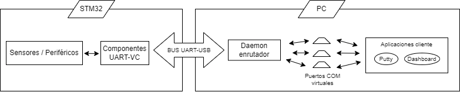
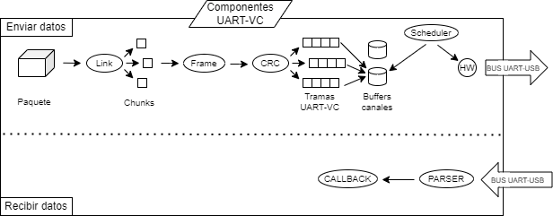

# UART-VC: Sistema de Conexión UART mediante Canales Virtuales

[](https://opensource.org/licenses/MIT)
[]()
[]()
[]()

UART-VC es un protocolo de red ligero y un *middleware* diseñado para dotar a las interfaces asíncronas tradicionales (UART) de capacidades avanzadas de multiplexación, fiabilidad y comportamiento en tiempo real.

Este proyecto permite que una única conexión física serie se comporte como múltiples canales lógicos independientes (hasta 16), aislando el tráfico crítico de control de la telemetría masiva y los *logs* de depuración. Es una solución ideal para la modernización de maquinaria industrial, robótica y sistemas empotrados con recursos de I/O limitados.

## 📋 Tabla de Contenidos
- [Características Principales](#-características-principales)
- [Arquitectura del Sistema](#-arquitectura-del-sistema)
- [Estructura de la Trama](#-estructura-de-la-trama)
- [Instalación y Despliegue](#-instalación-y-despliegue)
- [Uso y Herramientas](#-uso-y-herramientas)
- [Contribución](#-contribución)
- [Licencia](#-licencia)

## 🚀 Características Principales

- **Multiplexación de Canales (QoS):** Soporta hasta 16 canales virtuales con un planificador (*Scheduler*) basado en *Round-Robin* ponderado por ráfagas.
- **Preempción en Tiempo Real:** Los comandos de mayor prioridad pueden interrumpir instantáneamente la transmisión de flujos masivos de menos prioridad (latencia media RTT de ~0.5 ms).
- **Alta Fiabilidad (ARQ):** Implementa un esquema de control de flujo *Stop-and-Wait* con números de secuencia (SEQ) y retransmisión automática para recuperar paquetes perdidos.
- **Integridad y Transparencia:** Uso de *Byte-Stuffing* continuo al vuelo y validación matemática de tramas mediante el algoritmo CRC8.
- **Compatibilidad Dual-Mode:** Permite entrelazar paquetes binarios multiplexados con texto ASCII tradicional para mantener la depuración nativa activa.

## 🏗 Arquitectura del Sistema

El sistema UART-VC está diseñado bajo los principios de alta modularidad y separación de responsabilidades. Este enfoque estructural desacopla por completo la capa de aplicación, el motor de transporte lógico y la capa de presentación, permitiendo que cada bloque evolucione de forma independiente sin afectar al resto de la cadena de comunicación.

La topología general abarca tres grandes dominios que operan en cascada: el **Nodo Embebido** (Microcontrolador), el **Medio Físico** (Bus de comunicación) y el **Entorno de Usuario** (Dispositivo Anfitrión/Host).



---

### Desglose Funcional de los Componentes

La arquitectura de extremo a extremo se segmenta en seis bloques funcionales críticos, encargados de procesar la información desde su captura física hasta su análisis visual:

#### 1. Sensores y Periféricos (Frontera Física de Entrada/Actuación)
Representa el nivel más alto dentro del hardware del microcontrolador. Su única responsabilidad es interactuar con el entorno analógico o digital a través del silicio (ej. captura de temperatura mediante el ADC de 12 bits, lectura de entradas GPIO para eventos de pulsadores o conmutación de pines de salida para actuar sobre relés y motores). La lógica programada en este bloque desconoce por completo la existencia de la red o la multiplexación; simplemente genera variables limpias (*payloads*) y las deposita en las capas inferiores.

#### 2. Componentes UART-VC (Núcleo Algorítmico Embebido)
Constituye el motor de transporte y el escudo de protección de los datos frente al ruido electromagnético. Su misión es ordenar, priorizar y empaquetar de forma estructurada las cargas útiles asíncronas de la aplicación. 

El recorrido interno de un paquete de datos sigue un flujo estrictamente definido tanto en transmisión como en recepción:



* **En Transmisión (TX):**
    * **Link:** Recibe el paquete masivo desde la aplicación y, si este excede la MTU (`UARTVC_MAX_PAYLOAD`), realiza una fragmentación dinámica en porciones más pequeñas (*chunks*) utilizando variables de pila sin memoria dinámica (`malloc`).
    * **Frame & CRC:** Encapsula cada fragmento inyectando los bytes de sincronismo (`START`), metadatos de cabecera (`HDR`), campos de longitud (`LEN`), números de secuencia binarios (`SEQ`) y calcula la firma polinómica de integridad (`CRC8`).
    * **Buffers de canales:** Las tramas resultantes se depositan en una matriz de buffers circulares estáticos (`queue_t`) independientes para cada uno de los 16 canales virtuales.
    * **Scheduler:** Monitoriza continuamente las colas y, aplicando una política de *Round-Robin* ponderada por ráfagas (*bursts*), despacha las tramas prioritarias hacia el hardware.
    * **HW:** Capa física de bajo nivel que interactúa con el periférico USART y gestiona las transferencias mediante el controlador DMA.
* **En Recepción (RX):**
    * **Parser:** Lee byte a byte desde el búfer circular asistido por DMA. Ejecuta una Máquina de Estados Finitos (FSM) encargada de procesar el algoritmo de *de-stuffing*, validar el CRC8 y reensamblar de forma asíncrona los fragmentos binarios.
    * **Callback:** Una vez detectado el flag de finalización (`FIN`), el paquete reconstruido y curado se entrega limpiamente a la aplicación de usuario mediante rutinas de retrollamada.

#### 3. Medio Físico de Transmisión
Comprende las líneas físicas de cobre de transmisión (`TX`) y recepción (`RX`) del microcontrolador, el trazado del circuito impreso (PCB) y el chip puente convertidor (ST-LINK o FTDI). Este bloque actúa como el canal Full-Duplex físico y cuello de botella del ecosistema, justificando la necesidad del protocolo al obligar a docenas de flujos de datos independientes a competir por un único medio compartido sin colisiones lógicas.

#### 4. Demonio Enrutador (Middleware del Host)
Es un servicio de software programado en Python que se ejecuta en segundo plano en el ordenador anfitrión y actúa como una pasarela (*Gateway*) bidireccional asíncrona. Diseñado bajo el patrón de arquitectura concurrente **Productor-Consumidor**, utiliza hilos independientes de alta prioridad (*Multithreading*) para leer ráfagas del puerto serie físico, ejecutar la réplica de la FSM de desempaquetado, validar firmas matemáticas y demultiplexar las cargas útiles en función de su identificador de canal virtual.

#### 5. Puertos COM Virtuales (Infraestructura de Kernel)
Los puertos serie de los sistemas operativos modernos imponen políticas de acceso exclusivo (un solo programa puede abrir un puerto a la vez). Para permitir el acceso en paralelo de múltiples clientes, este bloque instancia emuladores *Null-Modem* (como VSPE en Windows o pseudoterminales PTY en Linux) que crean túneles de memoria RAM. El Demonio Enrutador inyecta los datos demultiplexados en un extremo del túnel y expone el otro extremo como un puerto serie estándar independiente, engañando al software superior para simular conexiones de hardware dedicadas.

#### 6. Aplicaciones Cliente (Capa de Aplicación Final)
El eslabón terminal consumido por el usuario, que engloba terminales orientadas a texto tradicional (PuTTY) o cuadros de mando interactivos (*Dashboards* en PyQt5). Gracias al aislamiento del *middleware*, estas aplicaciones operan con absoluta ignorancia del protocolo: simplemente abren una interfaz virtual serie genérica y consumen información limpia y segmentada exclusivamente para ellas, garantizando una excelente escalabilidad en el espacio de usuario.

## 📦 Estructura de la trama

El encapsulamiento se realiza mediante una trama de longitud variable (hasta 64 bytes de *payload* por defecto):

| START | HDR | LEN | SEQ (Opcional) | PAYLOAD | CRC8 |
| :---: | :---: | :---: | :---: | :---: | :---: |
| `0x7E` | `Control + Channel ID` | `0-255` | `Ack Sequence` | `Datos brutos` | `Firma` |

## 🛠️ Referencia de la API (Firmware C)

El firmware está diseñado siguiendo un enfoque modular y orientado a eventos. A continuación se detallan las funciones principales necesarias para inicializar, transmitir y recibir datos utilizando el protocolo UART-VC.

### 1. Control de Enlace y Transmisión (`uartvc_link.h`)

#### `uartvc_send_packet`

Divide cargas útiles genéricas en fragmentos lógicos (*chunks*) y los encola en el canal virtual seleccionado.

```c
void uartvc_send_packet(uint8_t ch, const uint8_t *payload, uint16_t len, uint8_t req_ack);

```

* 
**`ch`**: Identificador del canal virtual (rango válido de 0 a 15).


* 
**`payload`**: Puntero al bloque de memoria con los datos brutos que se van a transmitir.


* 
**`len`**: Tamaño en bytes de la carga útil.


* **`req_ack`**: Flag de control. Si se establece en `1`, el canal se bloqueará temporalmente esperando una confirmación (ACK) del receptor mediante el mecanismo Stop-and-Wait. Si es `0`, el envío se realiza sin confirmación.


---

### 2. Planificación y Calidad de Servicio (`uartvc_scheduler.h`)

#### `uartvc_set_channel_burst`

Configura el límite de tramas consecutivas que un canal específico puede inyectar en el medio físico antes de ceder el turno.

```c
void uartvc_set_channel_burst(uint8_t channel, uint8_t burst);

```

* 
**`channel`**: ID del canal virtual (0-15).


* 
**`burst`**: Número máximo de tramas consecutivas permitidas (útil para evitar que flujos masivos provoquen la inanición de canales críticos).


#### `uartvc_scheduler_run`

Orquesta el vaciado de los buffers circulares basándose en la política de prioridades estáticas y ráfagas. Debe invocarse continuamente dentro del bucle de ejecución infinito del sistema.

```c
void uartvc_scheduler_run(void);

```

---

### 3. Recepción y Análisis Sintáctico (`uartvc_parser.h`)

#### `uartvc_parser_init`

Inicializa las variables de estado internas del analizador asíncrono y vincula la rutina de retrollamada (*callback*) de la aplicación.

```c
void uartvc_parser_init(uartvc_parser_t *p, function_ptr callback);

```

* 
**`p`**: Puntero a la estructura de contexto del analizador (`uartvc_parser_t`).


* 
**`callback`**: Puntero a la función encargada de procesar los paquetes completamente reensamblados y validados.


#### `uartvc_parser_process_byte`

Inyecta un byte recibido del medio físico en la Máquina de Estados Finitos (FSM) del protocolo. Realiza el *de-stuffing* y valida la integridad mediante CRC8 en tiempo real.

```c
void uartvc_parser_process_byte(uartvc_parser_t *p, uint8_t byte);

```

* 
**`p`**: Puntero a la estructura del analizador.


* 
**`byte`**: Byte crudo extraído del periférico UART (generalmente desde la rutina de interrupción de recepción o buffer circular de DMA).


#### `uartvc_parser_tick`

Actúa como un temporizador de vigilancia (*Watchdog*) interno. Purga los buffers de reensamblaje si un canal se queda bloqueado esperando fragmentos incompletos durante un tiempo excesivo. Debe llamarse en el bucle principal.

```c
void uartvc_parser_tick(uartvc_parser_t *p);

```

---

## 💻 Ejemplo de Integración Completa (`main.c`)

El siguiente fragmento ilustra cómo estructurar la inicialización, la rutina de recepción asíncrona y el lazo principal de control dentro del firmware:

```c
#include "main.h"
#include "uartvc_link.h"
#include "uartvc_scheduler.h"
#include "uartvc_parser.h"

// Instanciación global del contexto del analizador
uartvc_parser_t parser;

// Callback de la aplicación: Se ejecuta de forma asíncrona al completar una trama válida
void data_callback(uint8_t ch, const uint8_t *payload, uint16_t len) {
    // Canal 1 reservado para comandos críticos de actuación
    if (ch == 1 && len == 1 && payload[0] == 0x99) {
        HAL_GPIO_WritePin(GPIOB, GPIO_PIN_14, GPIO_PIN_SET); // Actuación física inmediata
    }
}

// Interrupción de recepción UART (IDLE Line / DMA)
void HAL_UART_RxCpltCallback(UART_HandleTypeDef *huart) {
    if (huart->Instance == USART3) {
        // En un despliegue real, se recorren los bytes almacenados por el DMA en el búfer
        // e ingresan uno a uno al procesador de la FSM:
        // uartvc_parser_process_byte(&parser, byte_recibido);
    }
}

int main(void) {
    // 1. Inicialización de periféricos hardware (HAL, Relojes, UART, DMA...)
    HAL_Init();
    SystemClock_Config();
    MX_DMA_Init();
    MX_USART3_UART_Init();

    // 2. Inicialización de los componentes lógicos del protocolo
    uartvc_parser_init(&parser, data_callback);
    uartvc_set_channel_burst(1, 1); // Canal 1: Alta prioridad (comandos cortos)
    uartvc_set_channel_burst(2, 4); // Canal 2: Prioridad media (telemetría volumétrica)

    uint8_t msg_prioritario[] = "ALERTA_QOS";

    while (1) {
        // Ejecución continua de las tareas de red en segundo plano
        uartvc_scheduler_run();
        uartvc_parser_tick(&parser);

        // Ejemplo: Envío asíncrono no bloqueante condicionado por eventos
        if (Trigger_Event) {
            uartvc_send_packet(1, msg_prioritario, sizeof(msg_prioritario), 1); // Requiere ACK
            Trigger_Event = 0;
        }
    }
}

```

## 🛠 Instalación y Despliegue

### Prerrequisitos
- **Hardware:** Placa de desarrollo de la familia STM32 (Validado en STM32F746ZG Nucleo-144).
- **Software Host:** Python 3.x y emuladores de puertos *Null-Modem* (ej. VSPE en Windows).

### Compilación del Firmware (STM32)
1. Clona el repositorio: `git clone https://github.com/pegedev0/uart-virtual-channels.git`.
2. Abre el proyecto situado en la carpeta `/firmware` utilizando **STM32CubeIDE**.
3. Compila el proyecto y carga (*flash*) el código binario en la placa.

### Configuración del Host (Python)
1. Instala las dependencias del *middleware* y el *Dashboard*:
```bash
pip install pyserial PyQt5 matplotlib pyqtgraph
```
2. Descarga los archivos de la carpeta `/host_software`.
3. Crea los túneles virtuales en tu sistema operativo (por ejemplo, emparejando COM10 con COM11).

## 💻 Uso y Herramientas

El proyecto incluye herramientas nativas para visualizar y diagnosticar el flujo de red.

### 1. Demonio Enrutador (Gateway transparente)
Ejecuta el script principal para iniciar la demultiplexación desde el puerto físico hacia los puertos virtuales. Asegúrate de modificar los argumentos para que coincidan con tu configuración de hardware y tu software *Null-Modem*:

```bash
python daemon_enrutador.py --port COM3 --vport1 COM10 --vport2 COM20
```

### 2. Dashboard de Diagnóstico (PyQt5)
Para monitorizar el estado de la red en tiempo real, auditar el ancho de banda útil (Goodput) y visualizar la telemetría interactiva de los 16 canales:  
```bash
python dashboard.py
```

## 🤝 Contribución
¡Las contribuciones son bienvenidas! El objetivo de hacer público este proyecto es que la comunidad académica y el sector industrial puedan auditar la arquitectura, adaptar el protocolo a sus placas o proponer mejoras. Siéntete libre de abrir un Issue o enviar un Pull Request.  

## 📄 Licencia
Este proyecto se distribuye bajo la licencia MIT. Consulta el archivo LICENSE para más información. Este proyecto fue desarrollado originalmente como Trabajo de Fin de Grado en Ingeniería de Computadores (Universidad de Sevilla).
